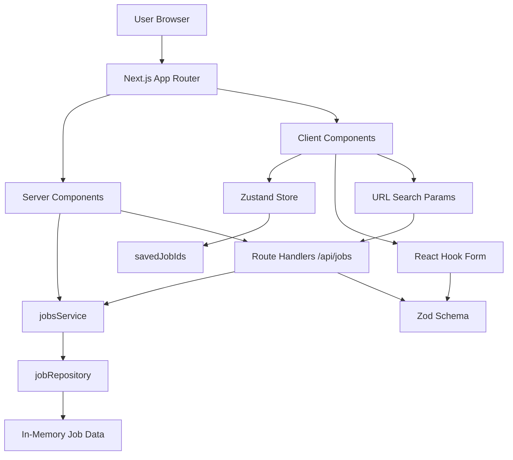

# Architecture Diagram — Session 5 Job Board



## Component Boundaries

```
Server (no "use client")
├── app/layout.tsx
├── app/page.tsx (home)
├── app/about/page.tsx
├── app/jobs/page.tsx
├── app/jobs/[id]/page.tsx
├── app/saved-jobs/page.tsx
├── features/jobs/components/JobCard.tsx
├── features/jobs/components/JobResults.tsx
├── features/jobs/components/JobListSkeleton.tsx
└── features/jobs/services/*

Client ("use client")
├── app/error.tsx
├── app/jobs/error.tsx
├── features/jobs/components/JobFilters.tsx
├── features/jobs/components/JobsBrowser.tsx
├── features/saved-jobs/components/SaveJobButton.tsx
├── features/saved-jobs/components/SavedJobsBadge.tsx
├── features/saved-jobs/components/SavedJobsList.tsx
├── features/saved-jobs/store/savedJobsStore.ts
└── features/job-posting/components/JobForm.tsx
```

## Feature Ownership

```
features/
├── jobs/
│   ├── components/  (JobCard, JobFilters, JobResults, JobsBrowser)
│   ├── services/    (jobsService, jobRepository)
│   ├── types/       (job, constants)
│   └── data/        (initialJobs)
├── saved-jobs/
│   ├── components/  (SaveJobButton, SavedJobsBadge, SavedJobsList)
│   └── store/       (savedJobsStore)
└── job-posting/
    ├── components/  (JobForm)
    └── schemas/     (jobSchema)

shared/
├── components/  (Button, Input, Textarea, Select, Card, Badge, Skeleton, EmptyState)
└── utils/       (formatDate, formatRelative, cx)
```

## Data Flow

```
User → /jobs (Server Component)
  → jobsService.list(query) → jobRepository → In-Memory Data
  → HTML + initial state → Client

User changes filter → JobsBrowser (Client)
  → setQuery → URL updated (useSearchParams + router.replace)
  → fetch(/api/jobs?...) → Route Handler
  → jobsService.list(query) → jobRepository
  → JSON response → Client updates state

User saves job → SaveJobButton (Client)
  → Zustand toggleJob(id) → persisted to localStorage
  → SavedJobsBadge updates (live subscription)
  → /saved-jobs reads ids → fetch(/api/jobs/[id]) for each
```

## Key Design Decisions

1. **Feature-Based Architecture** — capabilities grouped, not technical layers.
2. **JobCard in `features/jobs/`** — domain ownership over reuse location.
3. **Server Components by default** — SEO + faster first paint; Client only when interactive.
4. **Zustand for saved IDs only** — server data stays server-side; preferences are global client state.
5. **Lift State Up for filters** — parent (`JobsBrowser`) owns state; siblings read it.
6. **Single Zod schema** (`jobSchema`) — client validation + server validation share the same rules.
7. **URL-synchronized filters** — `useSearchParams` + `router.replace()` for shareable/bookmarkable state.
